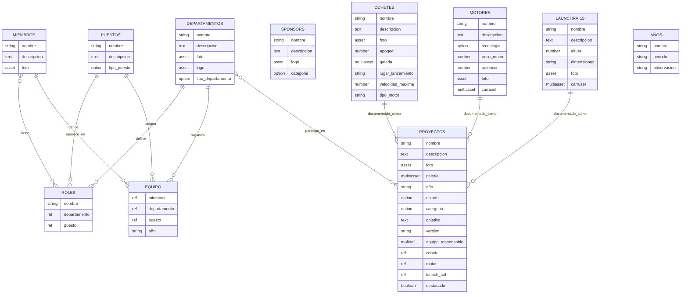

# Esquema general de la base de datos guía

La idea de esta base de datos no funcional es servir como **modelo visual y estructural** para organizar el contenido del equipo en la web. No está pensada como base de datos técnica real, sino como una **representación clara de tablas, campos y relaciones** que luego pueda trasladarse al CMS de WebFlow o a cualquier otro sistema más versatil como una DB en SQL.

El objetivo es cubrir:

- miembros del equipo
- departamentos y puestos
- roles combinados
- historial del equipo por año o etapa
- sponsors
- cohetes, motores y launch rails
- proyectos generales, tanto activos como antiguos
- y futuras ampliaciones como gestión temporal o años

---

# `erDiagram` completo



---

# Explicación de cada tabla

## 1. MIEMBROS

Esta tabla representa a cada persona del equipo como perfil general.

### Campos
- `nombre`
- `descripcion`
- `foto`

### Función
Guardar la ficha base de cada miembro.  
Aquí no se está modelando directamente todo su historial, sino su identidad general dentro de la web.

Además, según lo hablado antes, un miembro puede tener un campo de roles asignados de forma general, aunque esa parte también se cruza con la tabla `Equipo`.

---

## 2. DEPARTAMENTOS

Esta tabla guarda los departamentos del equipo.

### Campos
- `nombre`
- `descripcion`
- `foto`
- `logo`
- `tipo_departamento`

### Opciones planteadas para `tipo_departamento`
- Business and Management
- Avionics
- Propulsion
- Aerostructure
- Recovery
- Structures & Manufacturing
- Simulation
- Control

### Función
Documentar y organizar las áreas del equipo.

---

## 3. PUESTOS

Esta tabla guarda los distintos puestos que puede ocupar una persona.

### Campos
- `nombre`
- `descripcion`
- `tipo_puesto`

### Opciones planteadas para `tipo_puesto`
- Team Leader
- Facultie
- Financial Manager
- Project Managers
- Chief
- Technical
- Member
- Collaborator

### Función
Clasificar el rol funcional de cada miembro dentro de un departamento.

---

## 4. ROLES

Esta tabla actúa como tabla de ayuda o combinación entre `Departamentos` y `Puestos`.

### Campos
- `nombre`
- `departamento`
- `puesto`

### Función
La idea es que un rol combine ambas cosas, por ejemplo:
- Avionics + Member
- Recovery + Technical
- Propulsion + Chief

Sirve como referencia combinada para asignar roles generales a los miembros.

---

## 5. EQUIPO

Esta tabla representa realmente el historial operativo de los miembros.

### Campos
- `miembro`
- `departamento`
- `puesto`
- `año`

### Función
Cada fila representa una combinación concreta:
- un miembro
- en un departamento
- con un puesto
- durante un año determinado

Eso significa que un mismo miembro puede aparecer varias veces:
- por estar en varios departamentos
- por tener distintos puestos
- por repetirse en distintos años

### Ejemplo
- Juan — Avionics — Member — 2023
- Juan — Avionics — Chief — 2024
- Juan — Simulation — Member — 2024

Esta tabla es especialmente útil para búsquedas y filtros dentro de la web.

---

## 6. SPONSORS

Esta tabla guarda los patrocinadores.

### Campos
- `nombre`
- `descripcion`
- `logo`
- `categoria`

### Opciones definidas para `categoria`
- Cosmos
- Galaxy
- Nebula
- Star
- Satellite
- Earth
- Software

### Función
Representar el nivel o categoría del patrocinio según su aportación.

---

## 7. COHETES

Esta tabla guarda la información de los cohetes.

### Campos
- `nombre`
- `descripcion`
- `foto`
- `apogeo`
- `galeria`
- `lugar_lanzamiento`
- `velocidad_maxima`
- `tipo_motor`

### Función
`galeria` es un campo multi image para guardar varias imágenes.

Esta tabla funciona como ficha técnica o documental de cada cohete.

---

## 8. MOTORES

Esta tabla guarda los motores.

### Campos
- `nombre`
- `descripcion`
- `tecnologia`
- `peso_motor`
- `potencia`
- `foto`
- `carrusel`

### Opciones para `tecnologia`
- Híbrido
- Sólido
- Líquido

### Función
`carrusel` es un campo multi image.

Esta tabla sirve para documentar motores de forma independiente.

---

## 9. LAUNCHRAILS

Esta tabla guarda los launch rails.

### Campos
- `nombre`
- `descripcion`
- `altura`
- `dimensiones`
- `foto`
- `carrusel`

### Función
También aquí `carrusel` es un campo multi image.

La idea es tener una ficha para cada estructura o sistema de lanzamiento.

---

## 10. PROYECTOS

Esta es una de las tablas más importantes.

### Campos
- `nombre`
- `descripcion`
- `foto`
- `galeria`
- `año`
- `estado`
- `categoria`
- `objetivo`
- `version`
- `equipo_responsable`
- `cohete`
- `motor`
- `launch_rail`
- `destacado`

### Función
`galeria` es multi image.  
`equipo_responsable` es multireferencia a departamentos.

Esta tabla debe servir para guardar:
- proyectos activos
- proyectos antiguos
- cohetes
- versiones de cohetes
- drones de recovery como Vulture
- cajas de control
- contenedores de pruebas estáticas
- sistemas internos
- herramientas
- software
- desarrollos técnicos de cualquier tipo

La clave aquí es que **no todos los proyectos necesitan una tabla propia**.  
Algunos pueden tener además una ficha en `Cohetes`, `Motores` o `LaunchRails`, y otros existir solo dentro de `Proyectos` como Vulture o la Pelican de Juan (Nunca jamas volverá a ser estanca).

---

## 11. AÑOS

Esta tabla se ha añadido como tabla no conectada, a modo de exploración futura.

### Campos
- `nombre`
- `periodo`
- `observacion`

### Función
No está conectada a ninguna otra tabla porque todavía no se ha decidido cómo debería integrarse.

Su posible utilidad sería:
- representar cada año o temporada del equipo
- agrupar miembros por año
- construir páginas tipo “Equipo 2024”
- separar mejor la lógica temporal del resto de tablas

---

# Explicación de las relaciones

## DEPARTAMENTOS → ROLES

```text
DEPARTAMENTOS ||--o{ ROLES : define
```

Un departamento puede participar en varios roles.

### Ejemplo
- Avionics + Member
- Avionics + Team Leader

---

## PUESTOS → ROLES

```text
PUESTOS ||--o{ ROLES : define
```

Un puesto también puede participar en varios roles.

### Ejemplo
- Member puede existir en Avionics, Recovery o Simulation

---

## MIEMBROS ↔ ROLES

```text
MIEMBROS }o--o{ ROLES : tiene
```

Un miembro puede tener varios roles y un mismo rol puede pertenecer a varios miembros.

Esto representa el campo multireferencia de roles que se mencionó para la tabla `Miembros`.

---

## MIEMBROS → EQUIPO

```text
MIEMBROS ||--o{ EQUIPO : aparece_en
```

Un miembro puede aparecer varias veces en la tabla `Equipo`, porque puede estar:
- en varios departamentos
- con varios puestos
- y en varios años

---

## DEPARTAMENTOS → EQUIPO

```text
DEPARTAMENTOS ||--o{ EQUIPO : organiza
```

Cada fila de `Equipo` pertenece a un departamento concreto.

---

## PUESTOS → EQUIPO

```text
PUESTOS ||--o{ EQUIPO : asigna
```

Cada fila de `Equipo` también queda asociada a un puesto concreto.

---

## DEPARTAMENTOS ↔ PROYECTOS

```text
DEPARTAMENTOS }o--o{ PROYECTOS : participa_en
```

Uno o varios departamentos pueden participar en uno o varios proyectos.

Esto encaja con el campo `equipo_responsable` en `Proyectos`.

---

## COHETES → PROYECTOS

```text
COHETES ||--o{ PROYECTOS : documentado_como
```

Un cohete puede estar vinculado a uno o varios proyectos o registros documentales.

---

## MOTORES → PROYECTOS

```text
MOTORES ||--o{ PROYECTOS : documentado_como
```

Un motor también puede estar vinculado a un proyecto.

---

## LAUNCHRAILS → PROYECTOS

```text
LAUNCHRAILS ||--o{ PROYECTOS : documentado_como
```

Un launch rail también puede tener su reflejo dentro de `Proyectos`.

---

# Anotaciones y decisiones pendientes

## 1. Fechas y permanencia en el equipo

Hay que buscar una solución mejor para modelar el tiempo en la web.

Ahora mismo en `Equipo` está puesto:

- `año`

Pero más adelante conviene estudiar si sería mejor alguna de estas opciones:

- mantener `año` como campo simple
- sustituirlo por:
  - `fecha_inicio`
  - `fecha_final`
- añadir también información temporal en `Miembros`
- o crear una tabla aparte de:
  - `Años`
  - `Temporadas`

También se planteó la posibilidad de una tabla específica que represente cada año y relacione:
- nombre del año
- miembros de ese año
- y quizá también departamento y puesto de ese periodo

### Conclusión provisional
La opción más sólida a futuro probablemente será:
- `Equipo` con `fecha_inicio` y `fecha_final`
- o una tabla separada de temporadas si el histórico va a tener mucho peso en la web

---

## 2. Tema de `AÑOS`

La tabla `AÑOS` se ha añadido sin conexiones para dejar planteado este tema, pero todavía no está decidido cómo integrarlo.

### Posibles opciones
- conectarla con `Equipo`, si quieres que cada fila pertenezca a un año o temporada concreta
- usarla para agrupar miembros activos por año
- usarla para construir páginas del tipo “Equipo 2023”, “Equipo 2024”, etc.
- mantener solo el campo `año` simple si no hace falta tanta estructura

### Conclusión provisional
Ahora mismo se mantiene como una **tabla exploratoria no conectada**, solo para dejar visible que es un aspecto a estudiar más adelante.

---
