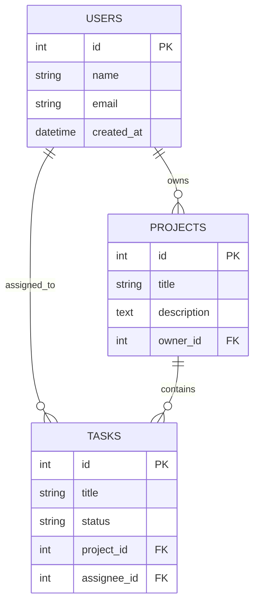

```mermaid
erDiagram
    USERS {
        int id PK
        string name
        string email
        datetime created_at
    }

    PROJECTS {
        int id PK
        string title
        text description
        int owner_id FK
    }

    TASKS {
        int id PK
        string title
        string status
        int project_id FK
        int assignee_id FK
    }

    USERS ||--o{ PROJECTS : owns
    USERS ||--o{ TASKS : assigned_to
    PROJECTS ||--o{ TASKS : contains
```
